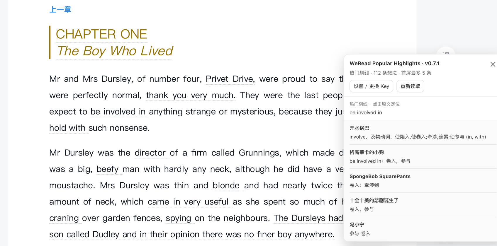

# WeRead Popular Highlights

在微信读书网页版正文旁显示**当前页的热门划线及划线人数**，方便阅读时查看其他读者关注的段落和真实想法。

当前版本：**0.7.1**。这是第三方用户脚本，并非腾讯官方产品。

## 功能

- 显示当前页热门划线、划线人数和正文旁标签。
- 翻页、滚动或切换章节后自动跟随当前阅读位置刷新。
- 点击划线或旁边的标签展开真实读者想法；当前最多展示 5 条。
- 点击展开面板中的原文，使用微信读书 reader 的官方 range 定位并高亮正文。
- 动态识别当前书籍、章节和划线范围，没有绑定特定书籍。

## Screenshot



## 安装

已安装 Tampermonkey？[点击安装用户脚本](https://raw.githubusercontent.com/aistacey2006/weread-community-highlights/main/weread-community-highlights.user.js)。

1. 在桌面浏览器安装 [Tampermonkey](https://www.tampermonkey.net/)。按扩展提示允许用户脚本运行。
2. 下载本项目的 `weread-community-highlights.user.js`。在 Tampermonkey 管理面板的「实用工具」中从文件导入，确认安装；也可以新建脚本，将文件的完整内容粘贴进去并保存。
3. 如果已安装同名旧版本，在 Tampermonkey 中确认只启用一个版本，避免重复运行。
4. 打开并刷新微信读书阅读页。目标站点为 `https://weread.qq.com/web/reader/*`。

不需要 npm、构建步骤或额外的 AI/Skill 安装。

## 获取并设置 API Key

1. 打开微信读书官方 [WeRead Skill 页面](https://weread.qq.com/r/weread-skills)。
2. 登录微信读书，在页面的「获取 API Key」区域获取以 `wrk-` 开头的 Key。
3. 回到阅读页，打开右下角脚本按钮，点击「设置 / 更换 Key」，粘贴并确认。也可以通过 Tampermonkey 的「设置 / 更换 WeRead API Key」菜单操作。
4. 等待当前页划线出现；需要时点击「重新读取」。更换 Key 使用同一入口。

## 数据与隐私

热门划线、人数和读者想法来自**官方 WeRead Agent API**，通过 `https://i.weread.qq.com/api/agent/gateway` 请求 `/book/underlines` 和 `/book/readreviews`。

API Key 只持久保存在 Tampermonkey 的 GM storage 中，不写入网页 localStorage、脚本源码或项目文件。请求时在用户脚本沙箱内读取 Key，并通过 HTTPS Authorization 请求头发送至官方接口；请求配置为 `anonymous: true`，不主动读取或携带浏览器 Cookie。页面中的 reader 桥接代码不接收 Key。

正文位置来自阅读页已有的 reader 状态、字符偏移与渲染对象。脚本调用页面已有的正文解码函数，没有打包解密算法。书籍、章节和划线范围按当前页面动态读取；数据不发送到本项目服务器。

## 已知限制

- 需要能够正常访问的微信读书桌面阅读页和有效 API Key；不绕过书籍阅读权限。
- 依赖微信读书内部 Vue/webpack reader 及官方 API，站点更新可能导致识别或定位失效。
- 本页没有热门划线时不会产生标签；想法当前仅展示首批最多 5 条。
- 当前页标记主要针对已验收的桌面阅读布局；其他布局、窄窗口或密集划线可能出现标签拥挤。
- 初次安装或 reader 未捕获时请刷新阅读页；网络或 Key 异常时会显示错误提示。

## 开发与许可证

`.user.js` 即完整、可编辑的源码与安装文件，无需构建。语法检查：

```sh
node --check weread-community-highlights.user.js
```

本项目代码使用 [MIT License](LICENSE)。代码来源检查见 [PROVENANCE.md](PROVENANCE.md)。许可证不覆盖微信读书服务、书籍正文、读者评论或其站点代码。
